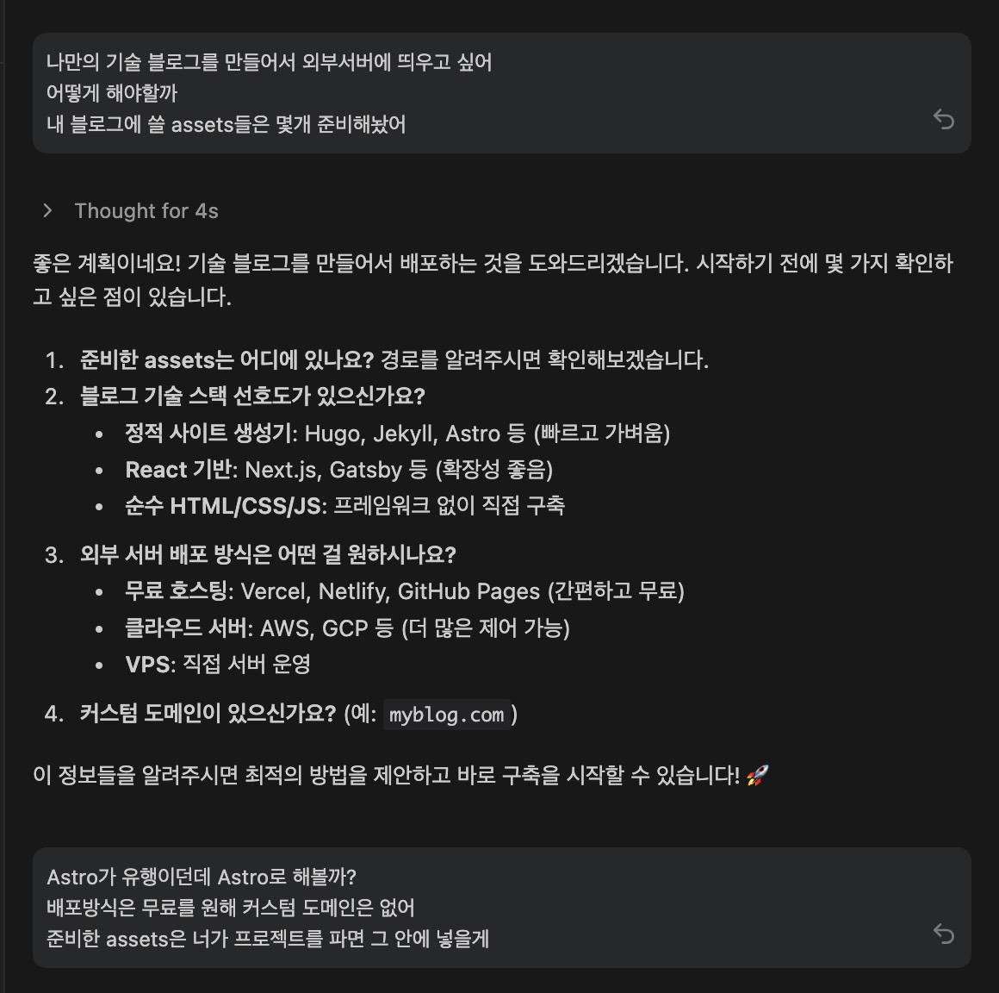
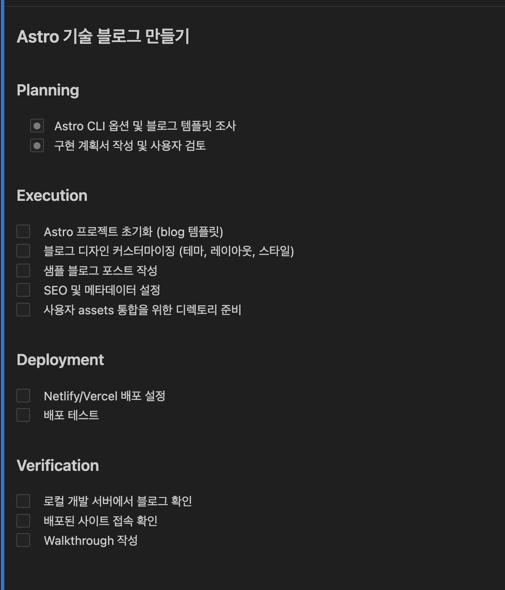
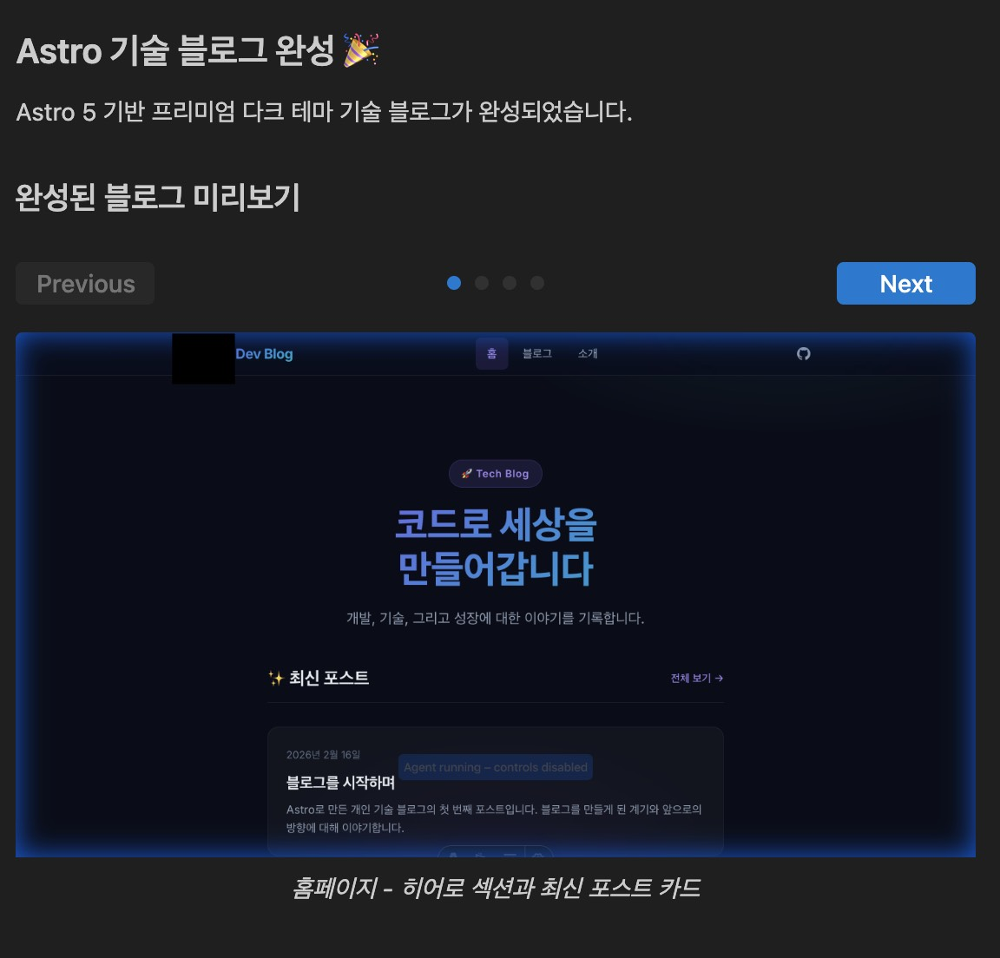
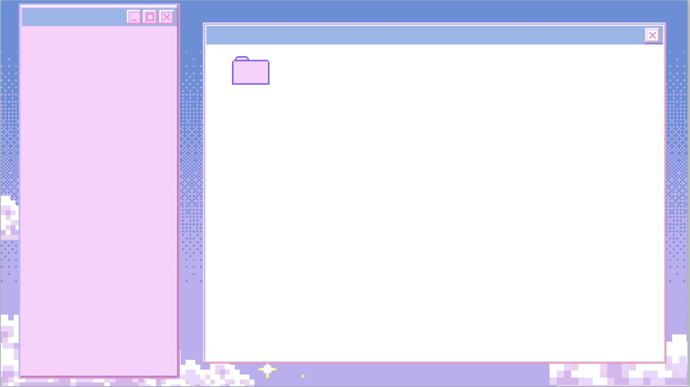

## 만들게 된 이유

맥북을 포맷하려고 파일들을 정리하다보니 발견한 
2년 전 레트로 느낌 블로그 만든다고 모은 에셋과 디자인

2년을 미뤄두다 안티그래비티와 포켓몬 도감작하면서 1시간만에 뚝딱 만들었다

## 과정 

생각해둔 스펙이 없어서 일단 모델을 claude opus4.6으로 하고 플랜을 짰다 

Astro 궁금했어서 Astro로 하라고 시켰다 (예전에 갯츠비 썼을 땐 md파일 하나 쓰면 다시 빌드해야지 볼 수 있던 것 같은데 얘는 그냥 데브서버에서 알아서 보인다 )

task파일과 walkthrough파일로 계획과 만들어진 과정을 보여준다 

요즘 바이브코딩으로 만든 사이트st들로 욕먹던 사이트들처럼 바로 만들어줌 

task파일과 walkthrough파일은 다시 보여달라고해도 보여주지만  .gemini/antigravity/brain 에 위치해 있다 

 

그리고 모아놓은 에셋들을 프로젝트에 넣고 아래 내가 구성했던 블로그 디자인을 참고해서 만들어달라고 했다

내가 구상한거보다 더 마음에 들게 만들어줬다

mdx까지 페이지 느낌에 맞게 알아서 만들어줌 

그 뒤로는 claude sonnet 4.5와 Gemini로 모델을 변경해서 다음과 같은 질문을 하며 블로그를 디벨럽했다

* ⭐ 로딩 화면 추가로 페이지 로딩 오버레이 만들기
* 💕 About 페이지에 사랑비 효과 추가
* 🧹 개인정보 제거 - 이름 삭제, 미사용 파일 정리
* 🚀 Netlify 배포 - GitHub 연동해서 무료 배포
* 💬 Astro 설명 - 무슨 역할인지
* ✍️ 블로그 글 작성법 - Markdown 문법, 이미지 삽입
* 📝 더 편한 글쓰기 도구 - Notion, Typora, VSCode 확장 추천

